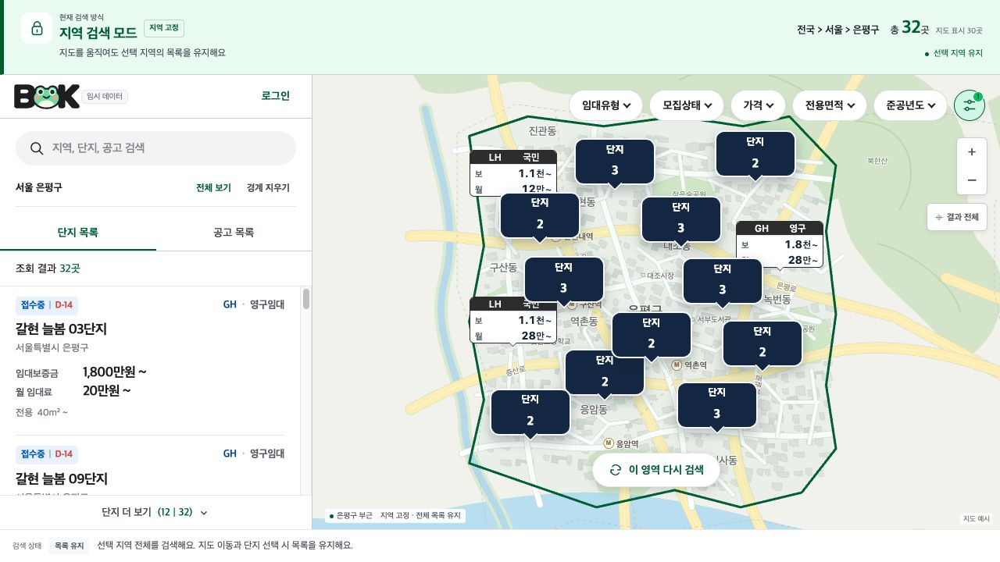
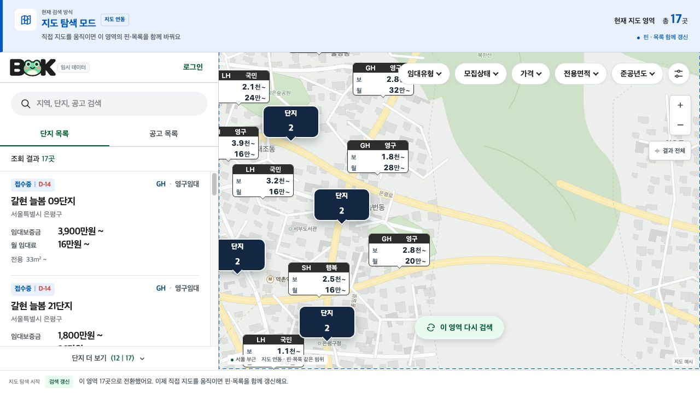
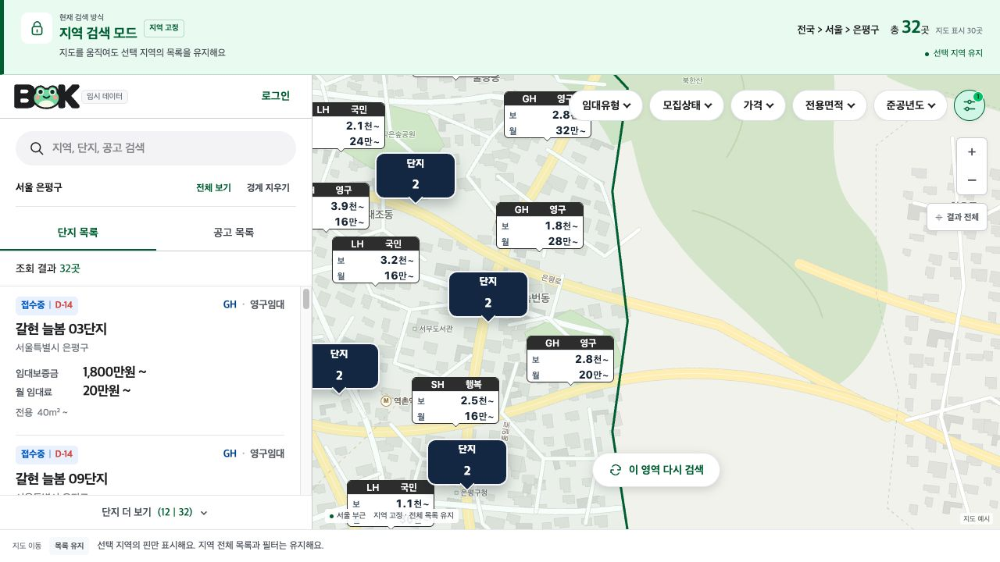
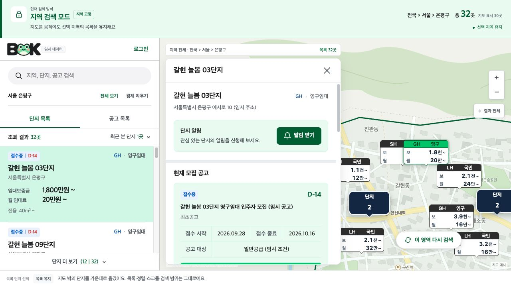

# 지도·검색 정책

이슈 #292 구현 브랜치의 정책이다. 운영 반영은 PR 검토·머지·배포 후 진행한다.
아래 이미지는 데모를 직접 조작한 화면이다. 단지·위치·숫자는 설명용 임시 데이터다.

## 1. 검색 모드

| 모드 | 검색 범위 | 직접 지도 이동 시 | 전환 방법 |
| --- | --- | --- | --- |
| **지역 검색 · 초록** | 선택 지역 전체 | 지역·경계·목록 유지. 해당 지역의 핀만 표시 | 기존 검색창에서 지역 검색·선택 |
| **지도 탐색 · 파랑** | 마지막으로 검색한 지도 영역 | 이동 종료 **300ms 후** 현재 영역의 핀·목록·총수 함께 갱신 | ‘이 영역 다시 검색’ 또는 지역 해제 |

모드 전환 시 비지역 필터는 유지한다. 단지·공고 필터는 각각 유지하되 공간 조건은 공유한다. 지도 이동·줌만으로 모드나 선택 지역을 바꾸지 않는다.
지역은 기존 검색창에 입력하며, **‘이 영역 다시 검색’은 지도 아래 중앙의 플로팅 버튼**으로 제공한다. 별도 지역 선택 바와 ‘처음으로’ 버튼은 두지 않는다.

| 지역 검색 — 지역 전체 32곳 | 지도 탐색 — 현재 화면 17곳 |
| --- | --- |
|  |  |

## 2. 단지 선택과 지도 이동

목록·공고·통합검색·최근 본 단지·지도 핀에 동일하게 적용한다.
**단지 선택 시 현재 줌과 검색 조건·목록·정렬·페이지·스크롤을 유지한다.**

| 단지 위치 | 지도 동작 |
| --- | --- |
| 충분히 보임 | 이동 없이 핀 강조·상세 표시 |
| 가장자리·패널에 가림 | 보이는 데 필요한 만큼만 이동 |
| 지도 밖 | 패널을 제외한 중앙 쪽으로 이동. **추가 확대 없음** |
| 좌표 미확인 | 상세만 표시 |

클러스터 펼치기·결과 전체 보기는 범위에 맞춰 줌을 조정할 수 있다. 패널·화면 크기 변경은 축척을 유지한다.
위 동작과 뒤로가기 복원으로 지도가 움직여도 자동 검색하지 않는다.

**예시: 목록의 ‘갈현 늘봄 03단지’ 클릭**

| 클릭 전 — 해당 단지는 지도 밖 | 클릭 후 — 단지 위치로 이동·상세 표시 |
| --- | --- |
|  |  |

*단지 위치로만 이동한다. 선택 전후의 줌·검색 조건·목록 32곳은 유지한다.*

## 3. 검색과 목록 갱신

| 행동 | 처리 |
| --- | --- |
| 지역·상위 경로 선택 | 지역 전체 검색·화면 맞춤. 상세를 닫고 경계·경로 교체 |
| 이 영역 다시 검색·지역 해제 | 현재 화면 검색. 상세·지역 조건·경계·경로 해제 |
| 비지역 필터 적용 | 지역 검색은 지역 전체 결과에 화면 맞춤. 지도 탐색은 현재 화면 검색·카메라 유지. 상세 닫기 |
| 정렬 변경 / 더보기 | 첫 페이지부터 재정렬 / 기존 목록 아래에 추가. 지도 유지 |
| 상세 닫기 | 선택만 해제. 지도·목록 유지 |

- **명시적인 지역·필터·정렬 변경:** 목록을 첫 페이지·맨 위로 초기화한다.
- **지도 탐색의 자동 갱신:** 결과 단지 ID가 같으면 페이지·목록 스크롤 유지, 달라지면 초기화한다. 공고는 전체 ID 비교를 제공하지 않아 새 영역 조회 시 첫 페이지로 갱신한다.
- **이동·조회 중:** 기존 핀·목록을 유지하고 완료된 같은 검색의 결과를 함께 반영한다. 연속 이동은 대기를 다시 시작하며, 이전 조건의 예약 검색·늦은 응답은 무시한다.
- **선택 단지가 새 결과 밖일 때:** 상세를 유지하고 ‘현재 결과 밖’으로 안내한다. 새 목록·총수에는 추가하지 않는다.

**예시: 지역 검색에서 지도 이동 → ‘이 영역 다시 검색’ 클릭**

| 클릭 전 — 이동해도 지역 전체 32곳 유지 | 클릭 후 — 현재 화면의 17곳으로 갱신 |
| --- | --- |
|  |  |

*지역 검색에서는 이동만으로 재검색하지 않는다. 버튼을 누르면 지도 위치·줌은 그대로 두고 현재 영역을 검색한다. 지도 탐색으로 전환한 뒤에는 직접 이동 시 자동 갱신한다.*

## 4. 지역·핀·숫자

### 지도 표현

- 지역 화면 맞춤은 **필터에 맞는 지역 전체 단지의 좌표**를 사용한다. 첫 페이지나 현재 보이는 핀만으로 계산하지 않는다.
- 패널·가장자리 여백을 확보하고, 지역 화면 맞춤은 NAVER 줌 15를 상한으로 한다. 넓게 분산된 단지도 모두 보이게 한다.
- 결과가 없거나 좌표가 모두 없으면 지역 범위로 이동하고 사유를 안내한다. 경계는 데이터가 있는 시·군·구에 표시하고, 미제공 지역은 별도로 안내한다.
- **겹치는 핀만 클러스터로 묶고 떨어진 핀은 개별 표시한다.** 묶음을 펼쳐도 검색·목록은 유지한다. 줌 17 이상이거나 같은 좌표에 모여 있으면 단지 선택 목록을 연다.
- 실제 행정 계층에 맞는 경로·상위 이동·하위 탐색을 제공한다. 단지가 많아도 하위 지역을 자동 선택하지 않으며, 읍·면·동은 데이터 확보 범위에서 지원한다.

### 집계 기준

- 지역 숫자 = **동일 필터의 지역 전체 고유 단지 수**. 하위 지역·과거 코드 별칭을 포함하고 단지 ID로 중복 제거한다. 클러스터 숫자는 해당 묶음의 단지 수다.
- 전체 결과 수, 불러온 수, 지도 표시 수를 구별한다. 좌표 없는 단지는 지역 목록에 포함하되 지도 영역 검색에서는 제외한다.
- 지도·집계·목록은 같은 공고 선택 규칙과 서울 기준 날짜를 사용한다. ‘접수 중’은 최신 대표 유효 공고의 `APPLYING` 기준이며, 공고 중·접수 예정·조건부·날짜 미확인과 구별한다.
- 공고도 같은 공간 조건으로 조회한다. 단지 수와 공고 수는 별도로 세고, 여러 단지에 연결된 같은 공고는 중복 계산하지 않는다.

## 5. 상태 안내와 복원

- 상단에 **모드·검색 범위·총수·갱신 상태**를 계속 표시한다. 행동 직후 변화만 짧게 안내한다.
- 지도만 이동해 검색 범위와 달라졌다면 ‘마지막 검색 영역 · 목록 유지’로 표시한다. 별도 모드가 아니다.
- 선택 지역의 필터·강조 경계·경로·URL은 함께 변경·해제한다. 단지 선택만으로 지역 상태를 바꾸지 않는다.
- URL에 모드·지역 또는 검색 영역·필터·정렬·탭·선택 단지/공고·카메라를 저장한다. 지도 카메라와 확정 검색 범위는 구분한다.
- 지역·필터·상세 선택과 직접 지도 조작 한 번을 이력 한 단계로 기록한다. 조작 중 개별 이동은 같은 이력을 갱신한다.
- 새로고침·URL 접속은 검색·선택·카메라를, 뒤로가기는 목록 페이지·스크롤과 페이지 전체 스크롤까지 복원한다.

## 구현과 검토 범위

- `/api/v2/complexes/search`가 동일 조건의 전체 단지 ID·총수·좌표 범위·핀·첫 페이지를 반환한다. `REGION`은 지역 전체, `AREA`는 지도 영역이다.
- 카메라 URL(`mapLat`, `mapLng`, `mapZoom`)과 검색 URL(`searchMode`, `searchBounds`, `boundaryRegionCode`)을 분리한다. 기존 지역 필터 URL도 같은 지역으로 정리한다.
- 지역 경로는 현재 시·도/시·군·구 데이터만 사용한다. 읍·면·동 탐색은 추가 데이터가 필요하다.
- 뒤로가기 목록 캐시는 현재 화면 세션의 최근 30개 검색을 보관한다. 새로고침·공유 링크는 첫 페이지부터 불러온다.
- 기존 지도 집계 API는 다른 사용처의 호환성을 위해 유지한다. 새 화면의 클러스터 숫자는 화면에서 묶인 단지 수다.
- 실제 NAVER 지도·PostgreSQL 환경에서의 상호작용과 광역 조회 성능은 PR 검토 시 확인해야 한다.
